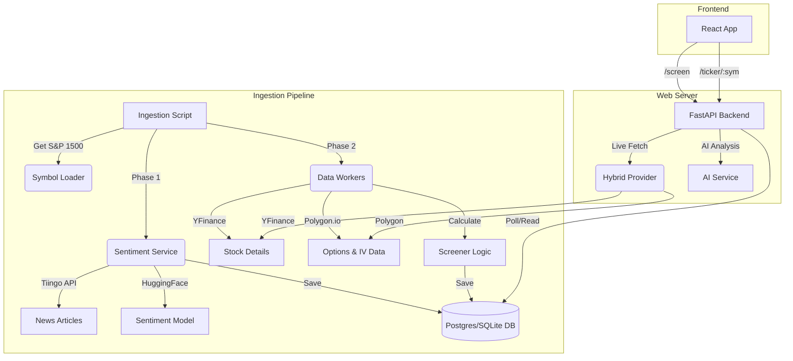

# System Architecture

This document outlines the architecture of the Stock Screener application, detailing the flow of data from ingestion to the frontend display.

## High-Level Overview

The system consists of two main operational phases:
1. **Ingestion Pipeline (Offline/Scheduled):** Fetches financial data and news, processes it, and stores it in a database.
2. **Web Server (Online):** API that queries the database to serve screening results and fetches real-time details for specific tickers.

## detailed Ingestion Flow (`ingest.py`)

The ingestion process is the core of the application, responsible for populating the database.

1.  **Initialization:**
    *   The script `ingestion.sh` triggers `ingest.py`.
    *   It loads the S&P 1500 ticker list via `symbol_loader.py`.

2.  **Phase 1: Sentiment Analysis (`sentiment.py`):**
    *   **Fetch:** Downloads news articles for all tickers from **Tiingo API**.
    *   **Analyze:** Uses a local Transformer model (`distilroberta-finetuned-...`) to score headlines (Positive/Negative).
    *   **Store:** Upserts results into the `stock_sentiment` table.
    *   **Cache:** Loads a map of `{symbol: score}` into memory for the next phase.

3.  **Phase 2: Data Processing (Parallelized):**
    *   Uses a `ProcessPoolExecutor` (default 4 workers) to process tickers in parallel.
    *   **Worker Logic (`process_ticker`):**
        *   **Hybrid Provider:**
            *   Fetches Fundamental Data (Market Cap, P/E, Margins) via **YFinance**.
            *   Fetches Options Data (IV30, Expired Contracts) via **Polygon.io**.
        *   **IV Rank Calculation:** Fetches 1-year historic IV data (from Polygon) to calculate the current IV Rank (0-100%).
        *   **Screening Algorithm:** Calculates a composite score (0-100) based on Value, Quality, Growth, and Volatility metrics.
    *   **Database Write:**
        *   The main process collects results from workers.
        *   Merges financial data with the pre-loaded Sentiment scores.
        *   Upserts records into `stocks` (static info) and `screen_results` (daily metrics) tables.

## Web Server And Data Serving (`main.py`)

The backend is built with **FastAPI** and serves data in two modes:

1.  **Screening Endpoint (`/screen`):**
    *   **Efficiency:** Does *not* fetch external data.
    *   **Operation:** Queries the `screen_results` table for the latest available date.
    *   **Filtering:** Applies SQL filters for Sector, Market Cap, Score, etc.
    *   **Output:** Returns a JSON list of pre-calculated results. This ensures the main table view is fast.

2.  **Ticker Details (`/ticker/{symbol}`):**
    *   **Real-time:** Fetches fresh data using the `HybridProvider` to ensure the detail view shows the latest price and options data.

3.  **AI Analysis (`/analyze/{symbol}`):**
    *   Uses stored screened data from the database (no live fetch).
    *   Passes data to `AIDescriptionGenerator` (backed by LLM) to generate a textual summary.

## Data Structures

*   **`Stock` Table:** Static company info (Name, Sector, Industry).
*   **`ScreenResult` Table:** Daily snapshots of metrics (Score, P/FCF, PEG, IV Rank, Sentiment Score).
*   **`StockSentiment` Table:** Most recent news sentiment analysis results.

## Key Components

*   **HybridProvider (`data_provider.py`):** A unified interface that routes requests to either YFinance (Fundamentals) or Polygon (Options/IV) seamlessly.
*   **Screener (`screener.py`):** Contains the business logic for scoring stocks (Value, Quality, Growth, Volatility models).
